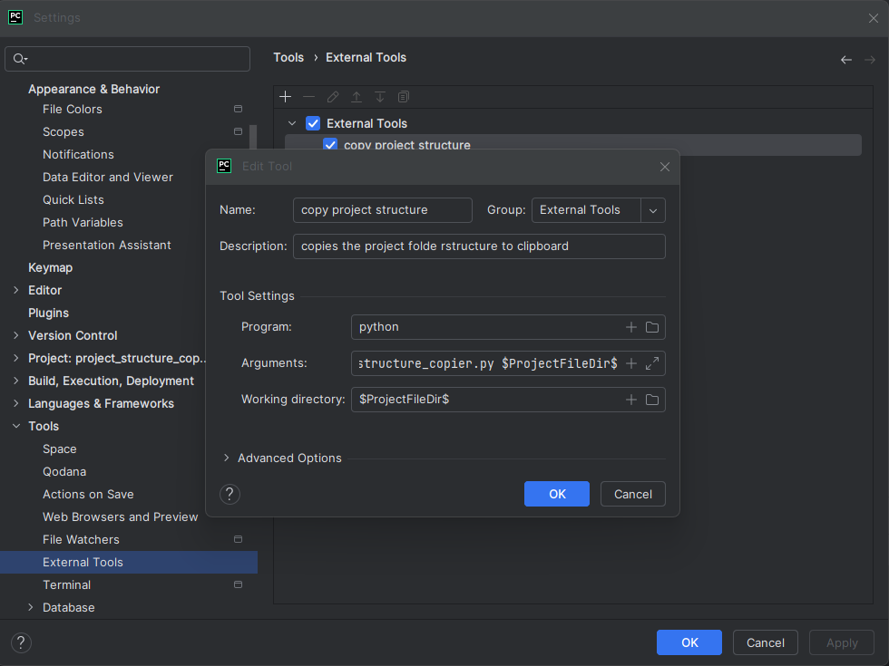

# Project Structure Copier

This tool allows you to quickly generate and copy a visual representation of your project's folder structure, respecting .gitignore rules and excluding the .git folder.

## Features

- Generates a tree-like structure of your project folders and files
- Respects .gitignore rules
- Automatically excludes the .git folder
- Copies the result to your clipboard for easy sharing

## Requirements

- Python 3.6 or higher
- pyperclip library

## Installation

1. Clone or download this repository to your local machine.

2. Navigate to the project directory:
    ```
    cd path/to/project-structure-copier
    ```

3. Create a virtual environment:
    ```
    python -m venv venv
    ```

4. Activate the virtual environment:
    - On Windows:
        ```
        venv\Scripts\activate
        ```
    - On macOS and Linux:
        ```
        source venv/bin/activate
        ```

5. Install the required dependencies:
    ```
    pip install -r requirements.txt
    ```

    These steps will set up a clean virtual environment and install all necessary dependencies from the requirements.txt file.


6. (Optional) Set up as a PyCharm External Tool for easy access.

## Usage

### As a standalone script

Run the script from the command line, providing the path to your project:
    ```
    python project_structure_copier.py /path/to/your/project
    ```

The structure will be printed to the console and copied to your clipboard.

### As a PyCharm External Tool

1. Open PyCharm and go to File > Settings (on Windows/Linux) or PyCharm > Preferences (on macOS).
2. Navigate to Tools > External Tools.
3. Click the + button to add a new External Tool.
4. Fill in the following:
   - Name: "Copy Project Structure"
   - Program: Path to your Python interpreter (e.g., "python" or full path)
   - Arguments: Path to the script followed by `$ProjectFileDir$`

     Example: "/path/to/project_structure_copier.py `$ProjectFileDir$`

   - Working directory: `$ProjectFileDir$`
5. Click OK to save.

   You can now access the tool from Tools > External Tools > Copy Project Structure.





### Adding a Shortcut in the Toolbar

- Right-click on the toolbar.
- Select "Customize Menus and Toolbars".
- Find "Main Toolbar" in the tree.
- Click the + button and add your External Tool.


Next you can have the button anywhere you like - left, right, center. I personally have mine on the right next to the RUN widget.
you can simply drag and move it around the toolbar tree structure :


### Setting up a Hotkey (Optional)

1. Go to File > Settings > Keymap (on Windows/Linux) or PyCharm > Preferences > Keymap (on macOS).
2. Find "External Tools > External Tools > Copy Project Structure".
3. Right-click and choose "Add Keyboard Shortcut".
4. Press your desired key combination (e.g., Ctrl + Alt + Shift + S).
5. Click OK.

## Output

The script generates a tree-like structure of your project, for example:


## Need help ? 
dm me on discord green.beret or on reddit u/General-Carrot-4624